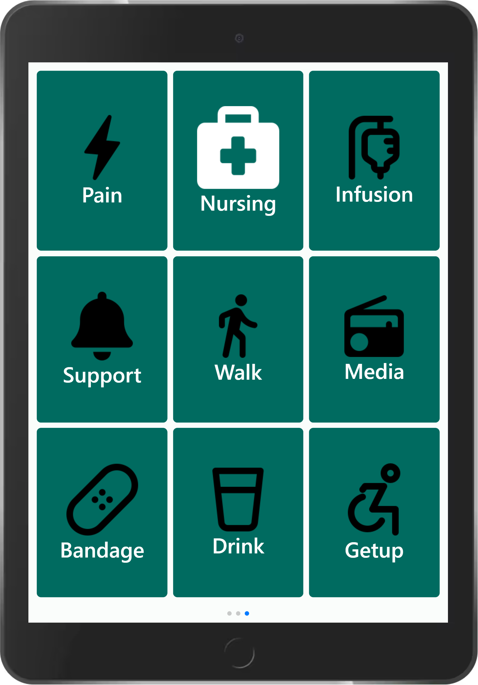

# cisGO!

[Check out the demo](https://starthack2024.web.app/)

## 📦 Overview

cisGO! is a nurse call system which finds the most suitable nurse based on various paramenters (e.g. compentency level or distance to patient) in a hospital environment. It aims to make processes faster and more efficient. It is a technology based on Cisco Space API.  

This project was part of the Cisco Challenge at the START Global Hackathon 2024. More information can be found [here](https://github.com/START-Hack/Cisco_STARTHACK24)

## 📱 Interfaces

### Multiple displays to choose from
2 Alarms |  6 Alarms | 9 Alarms
:-------------------------:|:-------------------------:| :-------------------------:
 |  | 


Button screen for patients|  Alarm screen for nurses
:-------------------------:|:-------------------------:
 | 


## ⬇️ Installation

### Install dependencies

First of all we need to install dependencies, run in terminal
```shell
npm install
```
```shell
pip install -r python/requirements.txt 
```

### Other Dependencies
Also in use: Firebase Realtime Database and [Cisco Space API](https://partners.dnaspaces.eu/docs/v1/basic/index.html#!c-dnas-partners-overview.html). 


##  🚀 How to start the programm
In order to start the programm, set up the dependencies and enter 
```
npm start
```
In order to start the nurse simulation, use `index.py` in the folder `python`. It will get the people movement data from the Cisco Space API and pump it into the Firebase realtime database. 


## ✍️ Authors

